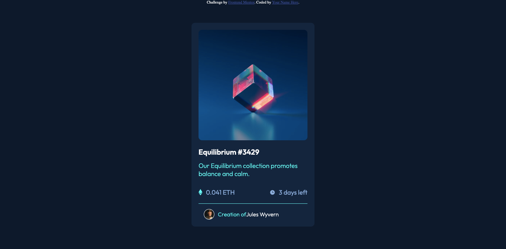

# Frontend Mentor - NFT preview card component solution

This is a solution to the [NFT preview card component challenge on Frontend Mentor](https://www.frontendmentor.io/challenges/nft-preview-card-component-SbdUL_w0U). Frontend Mentor challenges help you improve your coding skills by building realistic projects.

## Table of contents

-    [Overview](#overview)
     -    [The challenge](#the-challenge)
     -    [Screenshot](#screenshot)
     -    [Links](#links)
-    [My process](#my-process)
     -    [Built with](#built-with)
     -    [What I learned](#what-i-learned)
     -    [Continued development](#continued-development)
-    [Author](#author)

## Overview

### The challenge

Your challenge is to build out this preview card component and get it looking as close to the design as possible.
Users should be able to:

-    View the optimal layout depending on their device's screen size
-    See hover states for interactive elements

### Screenshot

### Links

-    Solution URL: [Add solution URL here](https://github.com/esdra00/nft-preview-card-componenr.git)
-    Live Site URL: [Add live site URL here](https://esdra00.github.io/nft-preview-card-componenr/)

## My process

### Built with

-    Semantic HTML5 markup
-    Flexbox

### What I learned

### Continued development

## Author

-    Website - [Add your name here](https://www.your-site.com)
-    Frontend Mentor - [@esdra00](https://www.frontendmentor.io/profile/esdra00)
-    Github - [@esdra00](https://github.com/esdra00)
